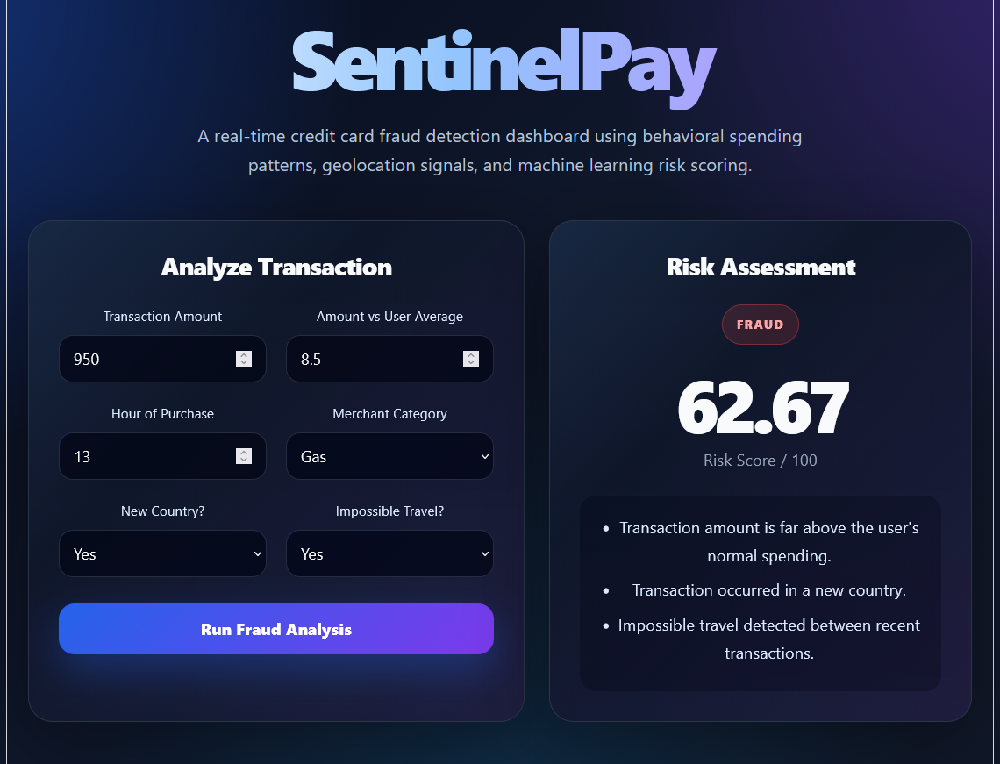

# SentinelPay - Credit Card Fraud Detection System

SentinelPay is a machine learning-powered fraud detection platform designed to identify potentially fraudulent credit card transactions using behavioral spending analysis, geolocation anomalies, and transaction risk indicators.

The system combines a Python-based machine learning model, a FastAPI backend, and a React frontend dashboard to provide real-time fraud risk assessments and explainable predictions.

---

## Overview

Financial institutions process millions of transactions daily, making manual fraud detection impossible at scale.

SentinelPay simulates a modern fraud detection workflow by analyzing transaction characteristics such as:

- Transaction amount
- Spending behavior deviations
- Unusual purchase times
- Geolocation anomalies
- New country purchases
- Impossible travel events
- Merchant category risk

The platform generates:

- Fraud / Legit predictions
- Risk scores (0-100)
- Human-readable explanations for flagged transactions

---

## Features

### Machine Learning Engine

- Synthetic transaction dataset generation
- Fraud scenario simulation
- Random Forest classification model
- Probability-based risk scoring
- Model persistence using Joblib

### Fraud Detection Signals

- Spending amount anomaly detection
- Amount vs user historical average
- Impossible travel detection
- New country transaction detection
- High-risk merchant category identification
- Unusual purchase hour detection

### Backend API

Built using FastAPI.

Endpoints include:

#### POST /predict

Analyze a transaction and return:

- Fraud prediction
- Risk score
- Fraud indicators

#### POST /transactions

Store analyzed transactions.

#### GET /transactions

Retrieve transaction history.

### Frontend Dashboard

Built using React and TypeScript.

Provides:

- Transaction analysis interface
- Real-time risk scoring
- Fraud status indicators
- Explainable fraud reasoning
- Modern cybersecurity-inspired UI

---

## Tech Stack

### Frontend

- React
- TypeScript
- Axios
- CSS

### Backend

- FastAPI
- Pydantic
- Uvicorn

### Machine Learning

- Python
- Pandas
- NumPy
- Scikit-Learn
- Random Forest Classifier
- Joblib

---

## System Architecture

```text
User Input
     |
     v
React Frontend
     |
     v
FastAPI Backend
     |
     v
Fraud Detection Model
(Random Forest)
     |
     v
Risk Score + Prediction
     |
     v
Dashboard Visualization
```

---

## Example Fraud Scenario

Transaction:

```json
{
  "amount": 950,
  "amount_vs_avg": 8.5,
  "hour": 13,
  "is_new_country": 1,
  "impossible_travel": 1,
  "merchant_category": "gas"
}
```

Result:

```json
{
  "prediction": "Fraud",
  "risk_score": 62.67
}
```

Detected indicators:

- Impossible travel
- New country transaction
- Abnormal spending amount
- High-risk merchant category
- Unusual purchase time

---
gt
## Screenshots

### Dashboard


### Fraud Detection Example



---

## Installation

Clone the repository:

```bash
git clone https://github.com/YOUR_USERNAME/CC-Fraud-Detector.git
cd CC-Fraud-Detector
```

Install backend dependencies:

```bash
pip install -r requirements.txt
```

Run FastAPI:

```bash
cd backend
uvicorn main:app --reload
```

Run frontend:

```bash
cd frontend
npm install
npm run dev
```

---

## Future Improvements

- PostgreSQL database integration
- User profile management
- Transaction history persistence
- Interactive analytics dashboard
- Geolocation visualization
- Docker containerization
- AWS deployment
- Streaming transaction analysis
- XGBoost anomaly detection
- User authentication and authorization

---

## Author

Pranav Battu

Arizona State University

Cloud Infrastructure • Cybersecurity • Distributed Systems